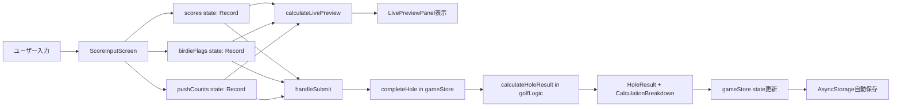
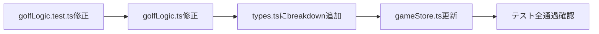

# テクニカルデザイン: Golf Las Vegas Overhaul

## 概要

### 目的
Golf Las Vegas アプリの計算ロジックバグを修正し、不足していたUI機能（バーディーチェックボックス・リアルタイムプレビュー・計算内訳）を実装する。また、ゲスト利用・ログインユーザーごとのクラウド履歴保存・データ永続化・コンポーネント分割・UXフロー改善によって、信頼性・保守性・使いやすさを向上させる。

### 対象ユーザー
ゴルフラウンド中にラスベガス計算を行うプレイヤー（4人1組）。

### 影響範囲
- `src/utils/golfLogic.ts` — 計算ロジックの全面修正（P0）
- `src/store/gameStore.ts` — 永続化ミドルウェア追加、型更新
- `src/types.ts` — `HoleResult` に `breakdown` フィールド追加
- `src/screens/StartScreen.tsx` — セットアップフォームを統合
- `src/screens/ScoreInputScreen.tsx` — コンポーネント分割により大幅スリム化
- `src/screens/LoginScreen.tsx` — 任意ログイン・新規登録UIを追加
- `src/screens/MyPageScreen.tsx` — ログインユーザーごとの履歴表示・再開・削除UIを追加
- `src/lib/supabase.ts` — Supabase client初期化
- `src/services/roundRepository.ts` — ラウンド履歴のDB保存・取得処理
- `src/components/` — 新規コンポーネント群を追加
- `src/utils/golfLogic.test.ts` — テストを仕様準拠に修正

### 非対象
- ネイティブ（iOS/Android）ビルド設定
- 独自バックエンドAPI構築（SupabaseをBaaSとして利用）
- リアルタイム同時編集・同伴者とのライブ共有

---

## アーキテクチャ

### 既存アーキテクチャ分析

```
app/(tabs)/index.tsx
└── gameStatus === 'menu' → StartScreen
└── gameStatus === 'playing'|'finished' → ScoreInputScreen
app/mypage.tsx
└── ログインユーザーの保存済みラウンド一覧
```

現在の問題点：
- `ScoreInputScreen` が画面・ダイアログ・ビジネスロジックを全て内包（820行）
- `gameStore` がAsyncStorageと未接続でメモリのみに状態保持
- `golfLogic.ts` の倍率計算がspecification.mdと乖離

### 修正後のアーキテクチャ

```mermaid
graph TB
    A[app/(tabs)/index.tsx] --> B{gameStatus}
    B -->|menu| C[StartScreen]
    B -->|playing/finished| D[ScoreInputScreen]

    C --> C1[SetupForm コンポーネント]
    C --> C2[HistoryDialog コンポーネント]

    D --> D1[HoleHeader コンポーネント]
    D --> D2[PlayerScoreCard × 4]
    D --> D3[LivePreviewPanel コンポーネント]
    D --> D4[ScorecardDialog コンポーネント]
    D --> D5[HistoryDialog コンポーネント]
    D --> D6[ParSelectDialog コンポーネント]

    D2 --> E[useGameStore]
    D3 --> E
    E --> F[golfLogic.ts]
    E --> G[AsyncStorage + persist<br/>ゲスト/進行中ゲーム]
    C --> H[LoginScreen<br/>任意ログイン]
    C --> I[MyPageScreen<br/>ログイン必須]
    I --> J[roundRepository]
    J --> K[Supabase Auth + DB<br/>ユーザー別履歴]
```

### 主要な設計決定

#### 決定1: Zustand persist middleware によるデータ永続化

- **決定**: `zustand/middleware` の `persist` + `createJSONStorage(() => AsyncStorage)` を使用
- **背景**: `@react-native-async-storage/async-storage` が既にインストール済み（package.json 確認済み）。Zustand v5 は persist middleware 対応済み
- **代替案**: Redux Persist、手動 useEffect での AsyncStorage 書き込み
- **選択理由**: 既存の Zustand ストアに最小限の変更で永続化を追加できる。手動実装よりも信頼性が高い
- **トレードオフ**: ストアの全状態がシリアライズ可能である必要あり（関数は除外）

#### 決定2: コンポーネント分割の粒度

- **決定**: ダイアログ単位・プレイヤーカード単位で分割し、`src/components/score-input/` と `src/components/shared/` に配置
- **背景**: 820行の単一ファイルは変更の影響範囲が広く、レビューも困難
- **代替案**: Custom Hooks のみで分割（UIは維持）、Context APIで状態を渡す
- **選択理由**: UIとロジックの両方を分離することで、各コンポーネントの責任が明確になる
- **トレードオフ**: ファイル数が増えるが、1ファイルあたりの行数は300行以下に収まる

#### 決定3: バーディー判定の自動+手動ハイブリッド

- **決定**: `score < par` で自動チェック、かつユーザーが手動でON/OFFできるチェックボックスを設置
- **背景**: 現在は自動判定のみ。ゴルフではOBや特殊ルールで手動補正が必要なケースがある
- **代替案**: 手動入力のみ、自動判定のみ
- **選択理由**: 自動で便利さを提供しつつ、手動補正でエラー防止
- **トレードオフ**: 自動チェックのロジックがスコア変更時に毎回走る（計算コスト微増、無視できる）

#### 決定4: ログインは任意、保存・マイページのみログイン必須

- **決定**: 未ログインユーザーでもスコア計算・ホール確定・スコアカード表示を利用可能にする。クラウド保存、過去履歴同期、マイページはログイン必須にする
- **背景**: ゴルフ場では登録作業より即時利用が優先される。一方で、ユーザーごとの履歴保存にはSupabase AuthのユーザーIDが必要
- **代替案**: 起動時ログイン必須、完全ローカル保存のみ
- **選択理由**: 利用開始の摩擦を下げつつ、必要なユーザーだけクラウド履歴を使える
- **トレードオフ**: ゲスト状態とログイン状態の保存導線を分岐する必要がある

#### 決定5: Supabase Auth + RLSによるユーザー別履歴保存

- **決定**: `rounds`テーブルに`user_id`を持たせ、Row Level Securityで`auth.uid() = user_id`を強制する
- **背景**: Vercel Webアプリから直接DBを利用するため、ブラウザに公開されるanon keyでも安全にユーザー単位のデータ分離が必要
- **代替案**: Vercel Serverless API経由の独自認証、自前DB認証
- **選択理由**: Auth・DB・RLSが一体で提供され、最小コストでユーザー別履歴を実装できる
- **トレードオフ**: Supabaseプロジェクトと環境変数管理が必要になる

---

## システムフロー

### UXフロー（修正後・ゲスト利用対応）

```mermaid
graph TD
    A[アプリ起動] --> A1{Supabase sessionあり?}
    A1 -->|あり| A2[ログインユーザーとして復元]
    A1 -->|なし| A3[ゲストとして継続]
    A2 & A3 --> B{AsyncStorageに<br>進行中ゲームあり?}
    B -->|あり| C[ゲーム状態を復元]
    B -->|なし| D[StartScreen表示]
    C --> E{gameStatus?}
    E -->|menu| D
    E -->|playing/finished| F[ScoreInputScreen表示]

    D --> G[SetupFormをインライン表示]
    D --> G1[Login/New Account任意導線]
    D --> G2[MyPage導線<br/>未ログインならLoginへ]
    G --> H[試合名・レート・プッシュ制限・スタートコースを入力]
    H --> I[STARTボタン]
    I --> J[startGame() → gameStatus=playing]
    J --> F

    F --> K[ParSelectDialog表示]
    K --> L[スコア入力 & バーディーチェック]
    L --> M[LivePreviewがリアルタイム更新]
    M --> N{4人全入力?}
    N -->|No| L
    N -->|Yes| O[NEXT HOLEボタン活性化]
    O --> P[completeHole() 実行]
    P --> Q[HoleResult + Breakdown 算出]
    Q --> R[AsyncStorageに進行中ゲームを自動保存]
    R --> S{ホール18?}
    S -->|No| F
    S -->|Yes| T[Finished状態へ]

    T --> U{保存操作}
    U --> V{ログイン済み?}
    V -->|Yes| W[Supabase roundsへ保存]
    V -->|No| X[ログイン/新規登録を促す<br/>ゲーム状態は保持]
```

### 計算フロー（修正後）

```mermaid
graph TD
    A[calculateHoleResult 呼び出し] --> B[各チームの連結スコア算出<br>min×10 + max]
    B --> C{バーディー有?}
    C -->|TeamA持ち| D[TeamBのスコアをFlip<br>例: 46→64]
    C -->|TeamB持ち| E[TeamAのスコアをFlip]
    C -->|両方| F[両チームFlip]
    C -->|なし| G[スコアそのまま]
    D & E & F & G --> H[差分Diff = |A_final - B_final|]
    H --> I{引き分け?}
    I -->|Yes| J[ポイント=0<br>nextMultiplier更新]
    I -->|No| K[PushMultiplier算出<br>0人=×1, n人=2n×]
    K --> L[FinalPoints = Diff × effectiveMultiplier<br>PushとCOが両方ある場合は加算]
    L --> M[CalculationBreakdown生成]
    J --> M
    M --> N[HoleResult返却]

    subgraph キャリーオーバー更新ルール
        J --> J1{現在=1×?}
        J1 -->|Yes| J2[next=2×]
        J1 -->|No| J3[next=現在+2<br>例:2→4→6]
    end
```

---

## 要件トレーサビリティ

| 要件 | 対応コンポーネント / ファイル |
|------|-------------------------------|
| 1: キャリーオーバー倍率 | `golfLogic.ts` `calculateHoleResult` |
| 2: プッシュ倍率（CO同時発生時は加算） | `golfLogic.ts` `calculateHoleResult` |
| 3: バーディーFlipのみ | `golfLogic.ts` `calculateHoleResult` |
| 4: バーディーチェックボックス | `PlayerScoreCard.tsx` |
| 5: リアルタイムプレビュー | `LivePreviewPanel.tsx`, `golfLogic.ts` `calculateLivePreview` |
| 6: 詳細内訳表示 | `ResultBreakdown.tsx`, `types.ts` `CalculationBreakdown` |
| 7: データ永続化 | `gameStore.ts` persist middleware |
| 7a: ゲスト利用とログイン任意化 | `StartScreen.tsx`, `LoginScreen.tsx`, `authStore.ts`, `gameStore.ts` |
| 7b: ログインユーザーごとのクラウド履歴保存 | `supabase.ts`, `roundRepository.ts`, `MyPageScreen.tsx`, Supabase RLS |
| 8: UXフロー改善 | `StartScreen.tsx`, `SetupForm.tsx` |
| 9: コンポーネント分割 | `src/components/score-input/`, `src/components/shared/` |
| 10: テスト修正 | `golfLogic.test.ts` |
| 11: 日本語化 | `ja.ts`, `en.ts`, 全コンポーネント |
| 12: プッシュ残り回数 | `PlayerScoreCard.tsx` |

---

## コンポーネントとインターフェース

### ビジネスロジック層: `src/utils/golfLogic.ts`

**責任**: 全てのゲーム計算を担う。UIから完全に独立。

**修正対象関数:**

```typescript
// 修正後の倍率計算（仕様準拠）
function computeMultipliers(
  totalPushCount: number,
  currentCarryOverMultiplier: number
): { pushMultiplier: number; finalMultiplier: number } {
  const pushMultiplier = totalPushCount === 0 ? 1 : 2 * totalPushCount;
  const finalMultiplier =
    pushMultiplier > 1 && currentCarryOverMultiplier > 1
      ? pushMultiplier + currentCarryOverMultiplier
      : Math.max(pushMultiplier, currentCarryOverMultiplier);
  return { pushMultiplier, finalMultiplier };
}

// 修正後のキャリーオーバー更新ルール
function computeNextCarryOver(
  isDraw: boolean,
  currentCarryOverMultiplier: number
): number {
  if (!isDraw) return 1;
  return currentCarryOverMultiplier === 1 ? 2 : currentCarryOverMultiplier + 2;
}

// 既存シグネチャ維持（内部実装のみ変更）
export function calculateHoleResult(
  params: CalculateHoleResultParams
): HoleResult

// 修正後のプレビュー計算（バーディー含む）
export function calculateLivePreview(
  currentCarryOverMultiplier: number,
  scores: Record<PlayerId, Partial<ScoreInput>>,
  teamA_Ids: [PlayerId, PlayerId],
  teamB_Ids: [PlayerId, PlayerId],
  par: number | null
): LivePreviewResult
```

### 状態管理層: `src/store/gameStore.ts`

**責任**: ゲーム状態の保持と永続化。

**追加: persist middleware**

```typescript
interface PersistConfig {
  name: 'golf-lasvegas-game';
  storage: createJSONStorage(() => AsyncStorage);
  partialize: (state: GameState) => Omit<GameState, never>;
}

// アクション追加
interface GameActions {
  // 既存アクション維持 + 以下を追加
  clearCurrentGame: () => void; // savedRoundsを保持してゲームをリセット
}
```

**注意**: persist は `functions` を除外するため、アクション（`addPlayer` 等）は `partialize` で除外する必要はない（Zustand v5 が自動処理）。

### UIコンポーネント層: `src/components/`

#### `score-input/PlayerScoreCard.tsx`

**責任**: 1プレイヤーのスコア入力カード（スコア・バーディーチェック・プッシュ・チーム選択）

```typescript
interface PlayerScoreCardProps {
  player: Player;
  team: 'A' | 'B';
  score: number | undefined;
  isBirdie: boolean;
  pushCount: number;
  par: number | null;
  isFront9: boolean;
  onScoreChange: (id: PlayerId, value: string) => void;
  onBirdieToggle: (id: PlayerId) => void;
  onPushCycle: (id: PlayerId) => void;
  onTeamToggle: (id: PlayerId, team: 'A' | 'B') => void;
  onNamePress: (id: PlayerId, name: string) => void;
  totalScore: number;
}
```

**バーディー自動判定ロジック**（PlayerScoreCard内）:
- `useEffect`: `score` と `par` が変わるたびに `isBirdie = score < par` を自動セット
- ただし、ユーザーが手動でトグルした後はそのセッション中は自動判定を上書きしない（`isManualBirdie` フラグで管理）

#### `score-input/LivePreviewPanel.tsx`

**責任**: スコア入力中のリアルタイム計算結果プレビュー表示

```typescript
interface LivePreviewPanelProps {
  preview: LivePreviewResult;
  teamAPlayers: Player[];
  teamBPlayers: Player[];
  carryOverMultiplier: number;
}

interface LivePreviewResult {
  isComplete: boolean;      // 全員のスコアが入力済みか
  teamAFinalScore: number;  // フリップ後の連結スコア
  teamBFinalScore: number;
  teamAFlipped: boolean;
  teamBFlipped: boolean;
  winnerTeam: 'A' | 'B' | 'draw' | null;
  diff: number;
  pushMultiplier: number;
  carryOverMultiplier: number;
  finalMultiplier: number;
  estimatedPoints: number;  // 予想ポイント（正値）
}
```

#### `score-input/HoleHeader.tsx`

**責任**: ホール番号・倍率表示・前後ホールナビゲーション

```typescript
interface HoleHeaderProps {
  currentHole: number;
  par: number | null;
  liveMultiplier: number;
  isFront9: boolean;
  canGoPrev: boolean;
  canGoNext: boolean;
  onPrevHole: () => void;
  onNextHole: () => void;
  onParPress: () => void;
  onSettingsPress: () => void;
  onHelpPress: () => void;
  onRestartPress: () => void;
  onScorecardPress: () => void;
  onHistoryPress: () => void;
  language: 'en' | 'ja';
  onLanguageToggle: () => void;
}
```

#### `score-input/ParSelectDialog.tsx`

**責任**: パー選択ダイアログ（3/4/5）

```typescript
interface ParSelectDialogProps {
  visible: boolean;
  onSelect: (par: 3 | 4 | 5) => void;
}
```

#### `shared/SetupForm.tsx`

**責任**: 試合設定フォーム（StartScreenにインライン統合）

```typescript
interface SetupFormProps {
  initialValues: {
    matchName: string;
    rate: number;
    maxPushCountPerHalf: number;
    startCourse: 'OUT' | 'IN';
  };
  onStart: (values: SetupFormValues) => void;
}

interface SetupFormValues {
  matchName: string;
  rate: number;
  maxPushCountPerHalf: number;
  startCourse: 'OUT' | 'IN';
}
```

#### `shared/ScorecardDialog.tsx`

**責任**: ホール別スコア・ポイント一覧表示（StartScreen・ScoreInputScreen共用）

```typescript
interface ScorecardDialogProps {
  visible: boolean;
  onDismiss: () => void;
  history: HoleResult[];
  players: Player[];
  getPlayerTotalScore: (id: PlayerId) => number;
}
```

#### `shared/HistoryDialog.tsx`

**責任**: 保存済みラウンド一覧表示（StartScreen・ScoreInputScreen共用）

```typescript
interface HistoryDialogProps {
  visible: boolean;
  onDismiss: () => void;
  savedRounds: RoundResult[];
}
```

---

## データモデル

### 型定義の変更（`src/types.ts`）

**追加: `CalculationBreakdown`**

```typescript
interface TeamScoreBreakdown {
  player1Score: number;
  player2Score: number;
  combinedRaw: number;    // min×10+max 連結後
  flipped: boolean;       // フリップしたか
  combinedFinal: number;  // フリップ後の最終スコア
}

interface CalculationBreakdown {
  teamA: TeamScoreBreakdown;
  teamB: TeamScoreBreakdown;
  diff: number;
  pushMultiplier: number;      // 1 or 2×n
  carryOverMultiplier: number; // 1, 2, 4, 6, 8...
  finalMultiplier: number;     // both active: push + carryOver
  finalPoints: number;
  isDraw: boolean;
}
```

**変更: `HoleResult`** — `breakdown` フィールドを追加

```typescript
interface HoleResult {
  // ... 既存フィールド維持 ...
  breakdown: CalculationBreakdown; // NEW: 詳細計算内訳
}
```

**変更: `ScoreInput`** — `isBirdie` の意味を明確化（自動or手動、どちらでも設定可）

```typescript
interface ScoreInput {
  score: number;
  isBirdie: boolean;  // true = バーディー以上（自動判定 or 手動設定）
  pushCount: number;
}
```

### データフロー図



---

## エラーハンドリング

### エラー戦略

ゲームロジックの計算エラーはUIレベルでの入力バリデーションにより事前防止する。AsyncStorageの障害は静かにフォールバックする。

### エラーカテゴリと対応

| エラー | 発生箇所 | 対応 |
|--------|----------|------|
| スコア未入力でSubmit | ScoreInputScreen | ボタンを`disabled`にし、エラーメッセージ表示 |
| チーム割り当て不正（2対2でない） | ScoreInputScreen | 赤色エラーテキスト表示、Submit禁止 |
| パー未選択でSubmit | ScoreInputScreen | ParSelectDialogを再表示 |
| AsyncStorage読み込み失敗 | gameStore persist | 初期状態にフォールバック（エラーを投げない） |
| AsyncStorage書き込み失敗 | gameStore persist | サイレントに無視（ゲーム進行は継続） |
| `calculateHoleResult` の不正入力 | golfLogic.ts | TypeScript型により実行前に防止 |

---

## テスト戦略

### ユニットテスト: `golfLogic.test.ts`（仕様準拠に全面修正）

修正が必要なテストケース（現在バグを「正しい」として検証している）:

| テスト | 現在の期待値 | 修正後の期待値 | 理由 |
|--------|-------------|----------------|------|
| Birdie Rate | x2 (バーディーで倍率増加) | x1 (バーディーは倍率影響なし) | バーディーはFlipのみ |
| CarryOver x2 + Push1 + Birdie | x6 | x2 (carryover=1の場合。バーディー倍率なし) | バーディー除外 |
| Push 1人 | x2 | x2 (2×1=2) | これは正しい ✓ |
| Push 2人 | x4 | x4 (2×2=4) | これは正しい ✓ |

**追加するテストケース:**

```
- キャリーオーバー連続3回: x1→x2→x4→x6 の増加検証
- Push+CarryOver加算: Push2人(×4) + CarryOver×2 = ×6
- バーディーFlip + 倍率は変化なし: diff × 1 × 1
- 両チームバーディー: 両方Flip、倍率は変化なし
- DrawのあとWin: nextMultiplierが正しく2→1にリセット
```

### 統合テスト方針

- `gameStore.completeHole` → `calculateHoleResult` の連携テスト
- 連続ホールにおける `nextHoleMultiplier` の伝播テスト
- AsyncStorage の persist/restore テスト（モック使用可）

---

## マイグレーション戦略

### フェーズ1: P0バグ修正（最優先）



既存の `HoleResult` データ（savedRounds内）は `breakdown` が `undefined` になるが、表示時に `if (h.breakdown)` でガードすることで後方互換性を維持する。

### フェーズ2: 永続化追加

`gameStore.ts` に persist を追加。既存のゲームデータは初回起動時に存在しないため、INITIAL_STATE にフォールバック（自動）。

### フェーズ3: UI修正・コンポーネント分割

ScoreInputScreen の分割は既存ロジックの「移動」であり、動作変更を伴わない。分割後に手動での動作確認を実施する。

### フェーズ4: 新機能追加

バーディーチェックボックス・リアルタイムプレビュー・詳細内訳を追加。既存機能への影響は最小限。
